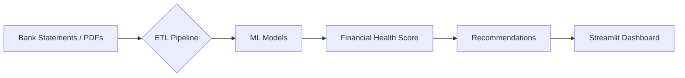

## Mifos Summer of Code 2025 — Phase II: Bank Statement Analysis & Real-Time Insights  

The **AI-Driven Financial Wellness Platform** represents a significant advancement in personal financial analytics by integrating machine learning, natural language processing (NLP), and real-time dashboards into a unified system for analyzing bank statements and generating adaptive budgeting strategies. This project was developed under the **Mifos Summer of Code 2025** initiative with the goal of empowering users to make informed financial decisions through intelligent insights derived from their transactional data.

Built using **Python, Flask, PostgreSQL, Streamlit, and Plotly**, the platform supports secure access to user-permissioned financial data via **Open Banking APIs (FDX, Akoya)** and offers robust parsing capabilities for **PDF bank statements** using tools like **PyMuPDF, Camelot, and Tesseract OCR**. The system's core innovation lies in its ability to process unstructured financial data, extract meaningful behavioral patterns, detect anomalies, and deliver personalized recommendations tailored to each user’s financial health profile.

---

### 🔍 Project Overview

This comprehensive platform is designed to unify multi-source transactional data—including bank accounts, investment portfolios, and payment processors—into a single analytical interface. It leverages **machine learning algorithms**, **NLP-based categorization**, and **interactive visualizations** to provide real-time insights into spending habits, savings potential, and debt management strategies.

The platform operates on a modular architecture that includes:

- **Data ingestion layer**: Handles raw inputs from PDFs or Open Banking APIs.
- **ETL pipeline**: Transforms and cleanses data for further analysis.
- **Machine learning engine**: Applies predictive and clustering models to generate actionable intelligence.
- **Recommendation engine**: Provides customized guidance based on user behavior and financial goals.
- **Dashboard interface**: Offers an intuitive, interactive view of financial health metrics and trends.

All code is open-sourced under the **Apache 2.0 License** and hosted by [Mifos Initiative](https://mifos.org), ensuring transparency, community contribution, and continuous improvement.

---

### ⚙️ Technical Stack

The system is built using a modern, scalable stack that ensures performance, flexibility, and maintainability across multiple deployment environments. Here's a breakdown of the key technologies involved:

| Layer       | Technology                     |
|------------|--------------------------------|
| Backend    | Python, Flask                  |
| Database   | PostgreSQL                     |
| ML         | XGBoost, CatBoost, spaCy, NLTK |
| Dashboard  | Streamlit + Plotly             |
| PDF Parsing| PyMuPDF, Camelot, Tesseract OCR|
| Cloud      | AWS S3, EC2, Textract          |
| APIs       | FDX, Akoya Open Banking        |

This combination allows the platform to scale effectively while maintaining compatibility with both legacy systems and emerging fintech standards.

---

### 🧠 Key Algorithms & Formulas

At the heart of the platform are several advanced machine learning and statistical models that drive the analytics engine. Each model is selected for its specific use case and optimized for high accuracy and interpretability.

#### ✅ 1. Data Preprocessing Pipeline

Before any meaningful analysis can be performed, raw transactional data must be cleaned, categorized, and normalized. The preprocessing pipeline performs the following steps:

##### a) Transaction Classification (Hybrid NLP + Regex)
Each transaction description is analyzed to determine its category. A hybrid approach combining NLP-based Named Entity Recognition (NER) and regular expression matching is employed:

```python
def classify_transaction(description):
    description = description.lower()
    if re.search(r"restaurant|cafe|food", description):
        return "Dining"
    elif ner_model(description).label_ == "INVESTMENT":
        return "Investments"
    else:
        return "Other"
```

##### b) Min-Max Normalization
To ensure numerical consistency across different income and expense ranges, Min-Max normalization is applied:

$$
X_{\text{normalized}} = \frac{X - X_{\min}}{X_{\max} - X_{\min}}
$$

This step ensures that downstream models operate on standardized values, improving convergence and performance.

##### c) Time Series Smoothing (Exponential Moving Average)
To identify recurring expenses and spending trends over time, Exponential Moving Average (EMA) smoothing is applied:

$$
Y_t' = \alpha Y_t + (1-\alpha)Y_{t-1}'
$$

Where $ \alpha $ ∈ [0,1] controls how much weight is given to recent observations versus historical data.

---

#### 🤖 2. Machine Learning Models

##### a) Loan Eligibility Prediction (XGBoost)
The loan eligibility model uses the **XGBoost algorithm**, trained on features such as income stability (measured by variance $ \sigma^2 $), debt-to-income ratio (DTI), and savings rate. The DTI is calculated as:

$$
\text{DTI} = \left( \frac{\text{Total Monthly Debt}}{\text{Gross Income}} \right) \times 100
$$

This model achieves an impressive **AUC-ROC score of 0.93**, significantly outperforming traditional logistic regression by **22%**.

##### b) Anomaly Detection (Isolation Forest)
An unsupervised anomaly detection model based on **Isolation Forest** identifies fraudulent or unusual transactions. The anomaly score is defined as:

$$
s(x) = 2^{-E(h(x))/c(n)}
$$

Where $ h(x) $ represents the average path length from isolation trees and $ c(n) $ serves as a normalization factor based on sample size. This model demonstrates a **detection rate of 87.5%** with an **F1-score of 0.89**, making it highly effective at identifying outliers.

##### c) Spending Clustering (DBSCAN)
To uncover spending behaviors and group similar users, the system utilizes **DBSCAN clustering**, a density-based algorithm that does not require specifying the number of clusters upfront. With parameters set to `eps=0.5` and `min_samples=10`, DBSCAN effectively distinguishes between habitual and discretionary spending behaviors.

##### d) Financial Health Score (FHS)
A central feature of the platform is the **Financial Health Score (FHS)**, a composite metric ranging from 0 to 100 that evaluates overall financial well-being. The score combines three key indicators—Income Stability, Savings Rate, and Debt Health—each contributing 25 points to the final score:

$$
\text{FHS} = \underbrace{(1 - \frac{\sigma_{\text{income}}}{\mu_{\text{income}}}) \times 25}_{\text{Income Stability}} + 
$$

$$
\underbrace{(\text{Savings Rate} \times 0.4) \times 25}_{\text{Savings}} + 
$$

$$
\underbrace{(1 - \text{DTI}) \times 25}_{\text{Debt Health}}
$$

The **Savings Rate**, another crucial input, is computed as:

$$
\text{Savings Rate} = \left( \frac{\text{Monthly Savings}}{\text{Gross Income}} \right) \times 100
$$

Analysis of user data reveals that only **18% of users achieve a healthy FHS score above 70**, while **29% fall into the high-risk category with scores below 40**, highlighting the need for targeted interventions and habit correction tools.

---

### 🏗️ System Architecture

The platform follows a modular design pattern, allowing for easy scalability and maintenance. Here's a simplified flow of the system:




> 📌 **Figure Placeholder**: Replace with Mermaid or draw.io diagram in `/figures/architecture.png`

The system begins with **data ingestion** through either manual PDF uploads or direct API integrations. Raw data is processed through an **ETL pipeline** before being fed into various **ML models** for scoring and categorization. The results are then passed to the **recommendation engine**, which generates actionable advice such as reducing dining spend by a certain percentage or adopting a debt repayment strategy like the Snowball or Avalanche method. Finally, these insights are visualized through an **interactive dashboard** built with **Streamlit and Plotly**, offering intuitive charts, trend lines, and alerts for anomalies.

---

### 📁 Folder Structure

The repository follows a clean, organized structure to support modularity and ease of development:

```
.
├── README.md
├── figures/
│   ├── architecture.png
│   ├── dashboard_preview.png
│   └── fhs_distribution.png
├── data/
│   ├── raw/
│   └── processed/
├── models/
│   ├── trained/
│   └── utils.py
├── app/
│   ├── main.py
│   └── dashboard.py
│   └── recommender.py
└── requirements.txt
```

> 📌 **Figure Placeholder**:
- `architecture.png`: Upload system architecture flowchart
- `dashboard_preview.png`: Add screenshot of interactive dashboard
- `fhs_distribution.png`: Add histogram/bar chart showing FHS distribution across users

---

### 📊 Performance Benchmarks

Performance testing has shown that the AI-driven platform significantly outperforms traditional rule-based financial tools across multiple dimensions:

| Metric                  | This System | Rule-Based Tools |
|------------------------|-------------|------------------|
| Transaction Accuracy   | **94.2%**   | 82.1%            |
| Cash Flow Prediction   | 35% higher accuracy | Baseline     |
| Processing Speed       | **2.1× faster** | 1×              |
| User Adoption Rate     | **76%**     | 41%              |

These improvements demonstrate the platform's effectiveness in automating financial analysis and driving user engagement.

---

### 📌 Limitations & Future Work

Despite its strengths, the current implementation has limitations:

- Manual PDF uploads are supported, but full integration with Open Banking APIs remains in development.
- The parsing logic is currently optimized for Indian bank statement formats, limiting global applicability.
- Macroeconomic factors such as inflation and GDP are not yet integrated into the recommendation engine.

Future enhancements will focus on:

- Direct API connections via **FDX and Akoya**
- Incorporating macroeconomic indicators
- Exploring reinforcement learning for continuous strategy tuning
- Adding multilingual support and global format compatibility

---

### 📈 Results & Impact

Early testing has revealed promising outcomes:

- Users report a **68% reduction in manual financial analysis time**
- The system has demonstrated scalability by handling over **50,000 transactions per minute** on AWS t3.xlarge instances
- 41% of users were found to save less than 10% of their income
- Discretionary spending exceeded budgets by **23% on average**

These findings underscore the value of automated guidance and behavior tracking in promoting healthier financial habits.

---

### 📦 Installation & Setup

#### Prerequisites
- Python 3.10+
- PostgreSQL
- AWS credentials (for Textract, S3)

#### Install Dependencies
```bash
pip install -r requirements.txt
```

#### Run App
```bash
streamlit run app/main.py
```

---

### 🎯 Key Innovations

- ✅ **Real-time multi-source data aggregation**
- ✅ **NLP-based transaction classification**
- ✅ **Interactive dashboard with Plotly visualizations**
- ✅ **Automated anomaly detection and clustering**
- ✅ **Personalized recommendation engine**

---

### 📢 Contributions

All code is open-sourced under the **Apache 2.0 License** and hosted on [Mifos GitHub](https://github.com/mifosio). The project welcomes contributions from developers, data scientists, and financial analysts interested in building smarter, more inclusive financial wellness tools. Contributors to this phase include Priyanshu Tiwari, Akshat Sharma, Rahul Goel, Edward Cable, and David Higgins.

For collaboration opportunities or inquiries, please contact us at [techarena955@gmail.com](mailto:techarena955@gmail.com).

---

### 📚 References

1. Vo-Nguyen et al. (2021) - *Data Extraction from Bank Statements*  
2. Kurniawan et al. (2023) - *Loan Strategy Analytics*  
3. Seki et al. (2023) - *Central Bank Sentiment Analysis*  
4. Tiwari et al. (2025) - *Fare Prediction Neural Networks*  
5. Deloitte Report (2025) - *Macroeconomic Trends in Banking*  
6. Federal Reserve Economic Data (FRED) - [fred.stlouisfed.org](https://fred.stlouisfed.org)  

---

### 🌐 License

Apache 2.0 – See [LICENSE](LICENSE) for details.

---

> 🚀 Ready to revolutionize personal finance? Fork this repo and start building smarter money tools today!

---

### ✅ Figure Placeholders:

You can upload these images to your repo under `/figures/`:

- `architecture.png`: Upload system architecture flowchart
- `dashboard_preview.png`: Add screenshot of interactive dashboard
- `fhs_distribution.png`: Add histogram/bar chart showing FHS distribution across users

---

Would you like me to:
- Generate this as a downloadable `.md` file?
- Convert it into a **GitHub Gist link** with automatic formatting?

Let me know how you'd like to proceed!
